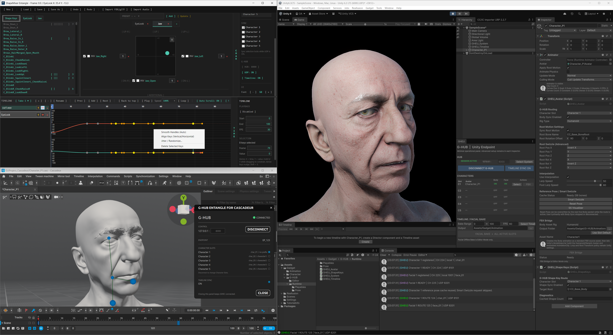
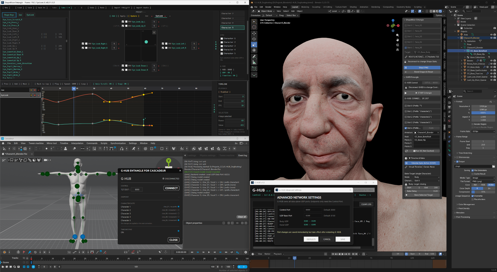

# TeamGadget Universal Real-Time Sync System

A modular real-time synchronization ecosystem centered around **G-HUB**.

The TeamGadget Universal Real-Time Sync System connects animation and game-engine tools through a shared routing layer instead of requiring every application to communicate directly with every other application.

**G-HUB** owns endpoint connection management, Character Slot routing, real-time body / facial data channels, and canonical timeline synchronization.

> Connect each TeamGadget component to G-HUB, assign matching Character Slots, and let the hub manage the route.

---

## Overview

The system is designed around a simple rule:

```text
Applications do not connect directly to each other.
They connect through G-HUB.
```

```text
                         ┌──────────────────────────┐
                         │          G-HUB           │
                         │  Central Sync / Routing  │
                         └────────────┬─────────────┘
                                      │
              ┌───────────────────────┼───────────────────────┐
              │                       │                       │
              ▼                       ▼                       ▼
     Cascadeur / GHEC         Unity / GHEU            Blender / GHEB
              ▲                       ▲                       ▲
              │                       │                       │
              └────────────── ShapeMixer Entangle ────────────┘
                              Facial / Shape Keys
```

The current v1.0 suite provides:

- real-time body synchronization
- real-time facial / Shape Key synchronization
- up to **5 Character Slots**
- centralized route management
- canonical timeline synchronization
- Rig-Agnostic / Smart Swizzle workflows for supported body endpoints
- offline facial animation bake for Unity and Blender
- offline body-animation bake directly to Blender Actions
- FBX Bridge body-animation transfer for Unity
- a dedicated facial-animation authoring environment through ShapeMixer Entangle

---

## Unity Workflow
> **Release Version v1.0 – Launch Date: October 4, 2026**

The Unity workflow combines:

- **Cascadeur + GHEC** for body animation
- **ShapeMixer Entangle** for facial / Shape Key animation
- **G-HUB** for routing and canonical synchronization
- **GHEU** as the Unity endpoint



For Unity production workflows:

```text
Body
Cascadeur / GHEC
      │
      ▼
    G-HUB
      │
      ▼
Unity / GHEU
      │
      └── FBX Bridge → Unity body animation asset
```

```text
Facial
ShapeMixer Entangle
      │
      ▼
    G-HUB
      │
      ▼
Unity / GHEU
      │
      └── Offline Facial Bake → BlendShape AnimationClip
```

Real-time body and facial synchronization can also run through the same G-HUB session.

For Offline Facial Bake, source and destination frame rates do not need to match. GHEU preserves canonical time and resolves each output frame against the corresponding SE source time.

---

## Blender Workflow
> **Release Version v1.0 – Launch Date: October 7, 2026**

The Blender workflow combines:

- **Cascadeur + GHEC** for body animation
- **ShapeMixer Entangle** for facial / Shape Key animation
- **G-HUB** for routing and canonical synchronization
- **GHEB** as the Blender endpoint



For Blender production workflows:

```text
Body
Cascadeur / GHEC
      │
      ▼
    G-HUB
      │
      ▼
Blender / GHEB
      │
      └── Offline Body Bake → Blender Armature Action
```

```text
Facial
ShapeMixer Entangle
      │
      ▼
    G-HUB
      │
      ▼
Blender / GHEB
      │
      └── Offline Facial Bake → Blender Shape Key Action
```

Real-time body and facial synchronization can run simultaneously through the same GHEB endpoint.

For Offline Bake, source and destination frame rates do not need to match. GHEB preserves canonical time and resolves each Blender output frame against the corresponding routed source time.

---

## Components

| Component | Role | Distribution |
| --- | --- | --- |
| **G-HUB** | Central communication, routing, Character Slots, canonical timeline | Prebuilt Windows x64 application |
| **GHEC** | Cascadeur endpoint | Mixed distribution: open-source files + compiled protected backend |
| **GHEU** | Unity endpoint | Open source + Unity package |
| **ShapeMixer Entangle (SE)** | Facial / Shape Key authoring and synchronization | Prebuilt Windows x64 application |
| **GHEB** | Blender endpoint | Open-source Blender add-on |
| **GHEG** | Godot endpoint | Planned |

---

## Released v1.0 Components

### G-HUB v1.0

**Universal Real-Time Sync Hub**

G-HUB is the center of the system.

It manages:

- endpoint registration
- Character Slot routing
- body and facial channels
- route creation and removal
- canonical timeline ownership and distribution
- configurable local network settings
- runtime channel / route monitoring

Documentation:

[`docs/g-hub/README.md`](docs/g-hub/README.md)

---

### GHEC v1.0

**G-HUB Entangle for Cascadeur**

GHEC connects Cascadeur to G-HUB and provides:

- real-time character streaming
- up to 5 Character Slots
- Smart Swizzle / reference-pose exchange
- canonical timeline synchronization
- bridge workflows used by supported destination endpoints

GHEC requires a supported paid Cascadeur license.

Documentation:

[`docs/ghec/README.md`](docs/ghec/README.md)

---

### GHEU v1.0

**G-HUB Entangle for Unity**

GHEU connects Unity to G-HUB and provides:

- real-time body synchronization
- Humanoid and Generic workflows
- Rig-Agnostic synchronization
- Smart Swizzle diagnostics
- root-motion and interpolation controls
- real-time facial / BlendShape synchronization
- multi-character routing
- canonical timeline synchronization
- GHEU Offline Facial Bake
- FBX Bridge body-animation transfer

Supported Unity version for GHEU v1.0:

- **Unity 6.3 LTS**
- Windows 64-bit
- Release package: `GHEU_v1.0_6.3LTS.unitypackage`

GHEU v1.0 is developed and validated specifically for Unity 6.3 LTS. Other Unity versions are not officially supported by this release.

Documentation:

[`docs/gheu/README.md`](docs/gheu/README.md)

---

### GHEB v1.0

**G-HUB Entangle for Blender**

GHEB connects Blender to G-HUB and provides:

- real-time body synchronization
- real-time facial / Shape Key synchronization
- up to 5 Character Slots
- simultaneous Body + Facial synchronization
- Rig-Agnostic / Smart Swizzle body workflows
- floating Smart Swizzle diagnostics
- optional Body Interpolation
- canonical timeline synchronization
- offline Body Bake to Blender Armature Actions
- multi-mesh facial synchronization and bake
- multi-character Facial Bake

Supported Blender version for GHEB v1.0:

- **Blender 5.2 LTS**
- Windows 64-bit
- Release package: `GHEB_v1_0_Blender5_2LTS.zip`

GHEB v1.0 is developed and validated specifically for Blender 5.2 LTS. Other Blender versions are not officially supported by this release.

Documentation:

[`docs/gheb/README.md`](docs/gheb/README.md)

---

### ShapeMixer Entangle v1.0

**Facial / Shape Key Authoring Endpoint**

ShapeMixer Entangle is a dedicated facial-animation tool with:

- FBX / glTF Shape Key import
- layered XY pads
- additional Shape Key controls
- presets
- multi-Take animation
- Bezier curve editing
- audio waveform reference
- up to 5 Character Slots
- real-time G-HUB facial synchronization
- canonical timeline synchronization
- GHEU Offline Facial Bake support

Documentation:

[`docs/se/README.md`](docs/se/README.md)

---

## Character Slots

The system supports up to **5 Character Slots**:

```text
C1
C2
C3
C4
C5
```

Character Slots keep body, facial, bake, and timeline-related data separated between multiple characters.

Matching endpoints use the same logical Character Slot while G-HUB handles the active transport route.

---

## Canonical Timeline Synchronization

G-HUB provides **full bidirectional timeline synchronization** between the current production endpoints:

- **Cascadeur / GHEC**
- **Unity / GHEU**
- **Blender / GHEB**
- **ShapeMixer Entangle / SE**

Any participating endpoint can drive the timeline, and the other connected endpoints follow the same canonical playback state through G-HUB.

Synchronized state includes:

- current time / frame position
- play
- pause
- stop
- scrub / seek
- playback range
- frame rate

### Time remains canonical across different FPS

The synchronization model preserves **time**, not merely identical frame numbers.

In other words:

> **1 second is always 1 second on every endpoint.**

If connected applications use different frame rates, each endpoint resolves the shared canonical time to its own local frame position.

For example:

```text
30 FPS endpoint → Frame 30 = 1.0 second
60 FPS endpoint → Frame 60 = 1.0 second
```

The visible frame numbers can therefore differ while the animation time remains synchronized.

This allows Cascadeur, Unity, Blender, and ShapeMixer Entangle to stay fully synchronized even when their local FPS settings are different.

Timeline synchronization is bidirectional: play, pause, stop, scrub / seek, range changes, and timeline position can be propagated through G-HUB so participating endpoints remain aligned.

---

## Design Principles

The suite is built around several core ideas.

### Centralized Routing

Endpoints communicate through G-HUB rather than implementing point-to-point integrations for every application pair.

### Character-Slot Isolation

Each character is assigned to a logical slot so body and facial data remain separated even when multiple characters are active.

### Rig-Agnostic Body Synchronization

Supported body endpoints exchange structure and reference-pose information so users do not need to create manual per-bone mappings for every compatible rig.

### Smart Swizzle

Smart Swizzle resolves reference-pose and local-axis differences between connected character structures while preserving each application's own rig conventions.

### Separate Body and Facial Production Paths

Where appropriate, body and facial animation use dedicated production workflows rather than forcing all data through one export mechanism.

For Unity v1.0:

- **Body asset:** FBX Bridge
- **Facial asset:** SE → G-HUB → GHEU Offline Facial Bake

For Blender v1.0:

- **Body asset:** GHEC → G-HUB → GHEB Offline Body Bake → Armature Action
- **Facial asset:** SE → G-HUB → GHEB Offline Facial Bake → Shape Key Action

---

## Downloads

Official binary and packaged releases are available from:

[**GitHub Releases**](https://github.com/TeamGadget-JP/UNIVERSAL_REAL-TIME_SYNC_SYSTEM/releases)

Current release tags use component-specific names such as:

```text
g-hub-v1.0.0
ghec-v1.0.0
gheu-v1.0.0
se-v1.0.0
gheb-v1.0.0
```

---

## Repository Structure

```text
UNIVERSAL_REAL-TIME_SYNC_SYSTEM/
├─ README.md
└─ docs/
   ├─ images/
   │  ├─ unity_workflow.png
   │  └─ blender_workflow.png
   │
   ├─ g-hub/
   │  ├─ images/
   │  ├─ LICENSE.txt
   │  └─ README.md
   │
   ├─ ghec/
   │  ├─ images/
   │  ├─ EULA.md
   │  ├─ LICENSE
   │  └─ README.md
   │
   ├─ gheu/
   │  ├─ images/
   │  ├─ LICENSE
   │  └─ README.md
   │
   ├─ gheb/
   │  ├─ images/
   │  ├─ LICENSE
   │  └─ README.md
   │
   └─ se/
      ├─ images/
      ├─ LICENSE
      └─ README.md
```

Component source and release assets are organized according to each component's distribution model.

---

## Licensing

Each component has its own license and distribution terms.

Please refer to the `LICENSE`, `LICENSE.txt`, or `EULA.md` included with the relevant component.

In general:

- **G-HUB** — proprietary TeamGadget binary distribution
- **ShapeMixer Entangle** — proprietary TeamGadget binary distribution
- **GHEC** — mixed distribution; open-source files and compiled proprietary backend are licensed separately
- **GHEU** — open-source Unity endpoint
- **GHEB** — open-source Blender endpoint

Third-party libraries and runtimes remain subject to their respective licenses and notices.

---

## Third-Party Notice

This repository contains independent **TeamGadget** projects designed to interoperate with third-party applications and file formats.

TeamGadget is not affiliated with, endorsed by, sponsored by, certified by, or officially supported by the developers or owners of Cascadeur, Unity, Blender, Godot, or other referenced third-party products unless explicitly stated otherwise.

All third-party product names and trademarks belong to their respective owners.

---

## Project

**TeamGadget**  
**Universal Real-Time Sync System**
