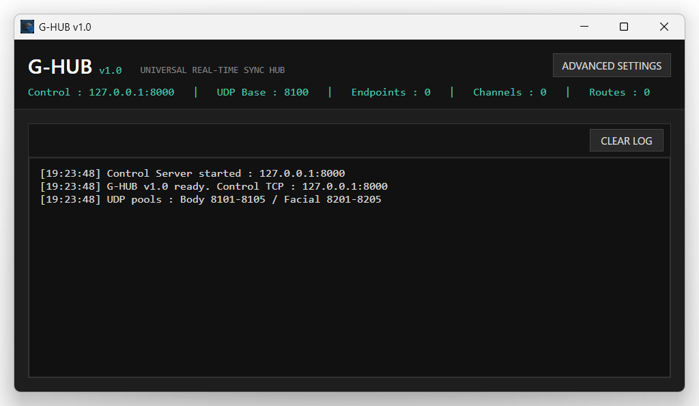
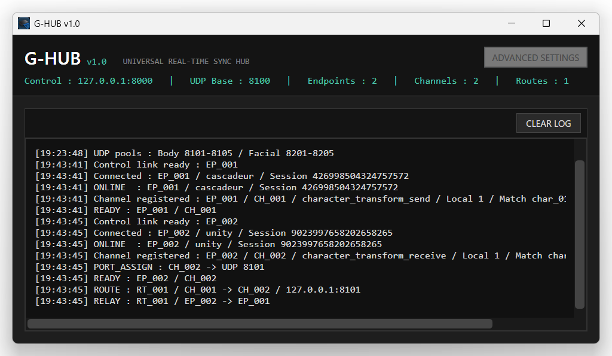
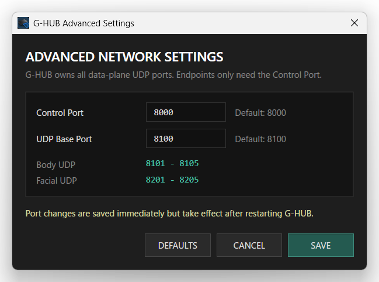

# G-HUB v1.0

**Universal Real-Time Sync Hub**

G-HUB is the central communication and routing component of the **TeamGadget Universal Real-Time Sync System**.

It manages endpoint connections, Character Slot routing, body and facial data routing, and canonical timeline synchronization between supported TeamGadget applications.

> G-HUB is designed to stay simple during normal use: start it, connect your endpoints, and let the hub manage routing.

---

## Overview

G-HUB acts as the central hub between TeamGadget synchronization components.

Components do **not** communicate directly with each other. Each supported component connects to G-HUB, and G-HUB owns routing, Character Slot assignment, and synchronization state.

Current TeamGadget components include:

- **G-HUB Entangle for Cascadeur (GHEC)** — Cascadeur-side synchronization component
- **G-HUB Entangle for Unity (GHEU)** — Unity synchronization component
- **G-HUB Entangle for Blender (GHEB)** — Blender synchronization component
- **ShapeMixer Entangle (SE)** — Facial animation and shape-key authoring tool

GHEC, GHEU, GHEB, and ShapeMixer Entangle are independent TeamGadget tools designed to work through G-HUB.



---

## Features

- Centralized real-time communication hub
- Dynamic endpoint connection management
- Up to **5 Character Slots**
- Body and facial data routing
- Canonical timeline synchronization
- Configurable Control Port
- Configurable UDP Base Port
- Automatic per-slot body and facial UDP port allocation
- Runtime route / channel status display
- Built-in event log
- Designed for TeamGadget Entangle components

---

## System Requirements

- **Windows 64-bit**
- G-HUB v1.0 is distributed as a prebuilt Windows application
- No installer is required

Compatible TeamGadget components are distributed separately.

---

## Installation

1. Download `G-HUB_v1.0_Windows_x64.zip`.
2. Extract the ZIP archive to any writable folder.
3. Run `GHub.exe`.

No installation is required.

> Keep all files from the extracted folder together. Do not move `GHub.exe` by itself.

---

## Quick Start

1. Start **G-HUB**.
2. Start the TeamGadget component you want to use.
3. Confirm that the component is configured to use the same **Control Port** as G-HUB.
4. Connect the component to G-HUB.
5. Enable or assign the required Character Slots.
6. Start synchronization.

During normal operation, G-HUB usually requires no additional configuration.

---

## Main Window

The G-HUB main window shows the current network and routing state.

The counters in the header update automatically as components connect and routes become active.



### Control

Shows the TCP control endpoint used by TeamGadget components to connect to G-HUB.

Default:

`127.0.0.1:8000`

The default configuration is intended for local communication on the same Windows PC.

### UDP Base

Shows the base UDP port used to derive per-character body and facial data ports.

Default:

`8100`

Default body ports:

| Character Slot | Body UDP Port |
| --- | ---: |
| C1 | 8101 |
| C2 | 8102 |
| C3 | 8103 |
| C4 | 8104 |
| C5 | 8105 |

Default facial ports:

| Character Slot | Facial UDP Port |
| --- | ---: |
| C1 | 8201 |
| C2 | 8202 |
| C3 | 8203 |
| C4 | 8204 |
| C5 | 8205 |

### Endpoints

Shows the number of currently connected TeamGadget synchronization components.

Examples include GHEC, GHEU, GHEB, and ShapeMixer Entangle.

### Channels

Shows the number of active data channels currently managed by G-HUB.

Channels are created and removed dynamically as connected components and Character Slots become active.

### Routes

Shows the number of currently active synchronization routes.

A route represents an active data path owned by G-HUB between compatible TeamGadget components.

### Log

The log area displays connection, channel, route, timeline, and relay events.

Use **CLEAR LOG** to clear the visible log history.

Clearing the log does not affect active connections or synchronization.

---

## Advanced Network Settings

Open **ADVANCED SETTINGS** to change the network configuration.



### Control Port

Default:

`8000`

All connected TeamGadget components must use the same G-HUB Control Port.

### UDP Base Port

Default:

`8100`

G-HUB derives Character Slot body and facial UDP ports automatically from this value.

### Changing Network Settings

Network settings cannot be changed while active endpoint, channel, or route state exists.

Disconnect active components before changing the network configuration.

Port changes are saved when **SAVE** is pressed, but they take effect after restarting G-HUB.

- **DEFAULTS** restores the default Control Port and UDP Base Port values.
- **CANCEL** closes the dialog without applying the current edits.
- **SAVE** stores the current values.

After saving changed ports, restart G-HUB before reconnecting components.

---

## Character Slots

G-HUB supports up to **5 Character Slots**:

- C1
- C2
- C3
- C4
- C5

Character Slots keep body, facial, bake, and synchronization data separated between multiple characters.

Slot assignment is controlled by the connected TeamGadget components.

G-HUB routes data according to the active slot configuration.

---

## Canonical Timeline Synchronization

G-HUB provides a central canonical timeline path used by supported TeamGadget components.

The active timeline owner publishes playback state to G-HUB, and participating components follow the canonical timeline state.

Depending on the connected component, synchronized timeline state can include:

- current frame
- play
- pause
- stop
- scrub / seek
- timeline range
- frame rate

Timeline synchronization is optional and can be enabled or disabled from supported TeamGadget components.

---

## Network Architecture

```text
Source-side components               Destination-side components
   ┌──────────────┐                         ┌─────────┐         
   │   Cascadeur  ├───── UDP Streaming ─────┤  Unity  │         
   │     GHEC     │                         │  GHEU   │         
   │              ├◄────── Handshake ──────►┤         │         
   └───────┬──────┘            ▲            └─────────┘         
           │                   │                 ▲              
           │             ┌─────┴─────┐           │              
           └────────────►┤           ├───────────┘              
                         │   G-HUB   │                          
           ┌────────────►┤           ├───────────┐              
           │             └─────┬─────┘           │              
           │                   │                 ▼              
   ┌───────┴──────┐            ▼            ┌─────────┐         
   │ ShapeMixer   ├◄────── Handshake ──────►┤ Blender │         
   │     Entangle │                         │  GHEB   │         
   │     (SE)     ├───── UDP Streaming ─────┤         │         
   └──────────────┘                         └─────────┘                           
```
Real-time body and facial data are routed through G-HUB. Control and canonical timeline synchronization may operate bidirectionally depending on the connected components.

**Important:** connected applications do not communicate directly with one another. G-HUB is the central routing and synchronization owner.

---

## Troubleshooting

### A component cannot connect

Check the following:

- G-HUB is running
- the component is using the same Control Port as G-HUB
- no other application is already using the configured port
- Windows Firewall or security software is not blocking local communication

### A character does not receive data

Check:

- the component is connected to G-HUB
- the intended Character Slot is enabled
- the sending and receiving applications are using the corresponding Character Slot
- the route is active in G-HUB

### Timeline does not follow

Check:

- Timeline Sync is enabled on the participating component
- the component is connected to G-HUB
- another participating component is currently acting as the canonical timeline owner

### Network settings cannot be edited

Disconnect active components first.

G-HUB intentionally locks network settings while endpoint, channel, or route state is active.

---

## Distribution

G-HUB is distributed as a **prebuilt Windows 64-bit application**.

Source code is not included in the public release.

Other TeamGadget synchronization components are distributed separately.

---

## License

G-HUB is free to use for personal and commercial animation production, subject to the included license terms.

See `LICENSE.txt` for the complete terms and restrictions.

---

## Third-Party Notice

This is an independent **TeamGadget** project.

TeamGadget is not affiliated with, endorsed by, sponsored by, certified by, or officially supported by the developers or owners of the third-party applications referenced in this project.

All third-party product names and trademarks belong to their respective owners.

---

## Project

**TeamGadget**  
**G-HUB v1.0 — Universal Real-Time Sync Hub**
