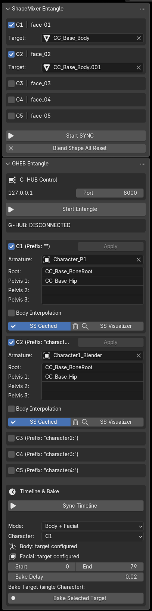

# GHEB — G-HUB Entangle for Blender

**G-HUB Entangle for Blender (GHEB)** is an independent TeamGadget synchronization component designed for use with Blender through G-HUB.

GHEB connects Blender to the **TeamGadget Universal Real-Time Sync System** and provides real-time body synchronization, real-time facial / Shape Key synchronization, multi-character routing, canonical timeline synchronization, Smart Swizzle diagnostics, optional body interpolation, and offline animation bake directly to Blender Actions.

> GHEB uses one shared Blender endpoint and one G-HUB Control connection for Body, Facial, Timeline, and Offline Bake workflows.

---

## Overview

GHEB is the Blender-side endpoint of the TeamGadget synchronization system.

GHEB does **not** communicate directly with Cascadeur or ShapeMixer Entangle.  
All routing, Character Slot matching, and canonical synchronization are handled through **G-HUB**.

```text
Cascadeur / GHEC
       │
       ▼
     G-HUB
       │
       ▼
Blender / GHEB
```

```text
ShapeMixer Entangle / SE
          │
          ▼
        G-HUB
          │
          ▼
    Blender / GHEB
```

Body and facial synchronization can run at the same time through the same GHEB endpoint.



---

## Features

- Real-time body synchronization through G-HUB
- Real-time facial / Shape Key synchronization through G-HUB
- Up to **5 Character Slots**
- Independent C1–C5 Body and Facial routing
- Simultaneous Body + Facial live synchronization
- Rig-Agnostic body synchronization for compatible character structures
- Smart Swizzle reference-pose mapping
- Persistent Smart Swizzle cache in the Blender scene
- Floating **SS Visualizer** diagnostic window
- Per-bone Search / Filter / Select / Frame / Copy Diagnostic tools
- Selected-bone 3D diagnostic axes
- Whole-character diagnostic markers and resolved-target axes
- Optional per-character Body Interpolation
- Canonical G-HUB Timeline synchronization
- Offline Body Bake to Blender Armature Actions
- Offline Facial Bake to Blender Shape Key Actions
- Body + Facial bake as separate Actions
- Multi-mesh facial synchronization and bake
- Multi-character Facial Bake for all active Face Slots
- Mixed-FPS Offline Bake using canonical time
- Configurable G-HUB Control Port
- Non-destructive live synchronization workflow

---

## Development / Tested Environment

GHEB v1.0 is developed and validated specifically for:

- **Blender 5.2 LTS**
- Windows 64-bit

Related TeamGadget components used with the v1.0 workflow include:

- **G-HUB v1.0**
- **GHEC v1.0.1**
- **ShapeMixer Entangle v1.0**

> GHEB v1.0 officially supports Blender 5.2 LTS only. Other Blender versions are not officially supported by this release.

---

## Distribution

The recommended release package name is:

```text
GHEB_v1_0_Blender5_2LTS.zip
```

The installed Python package folder remains:

```text
GHEB
```

Do **not** rename the internal add-on folder to `GHEB_v1.0`.

Blender loads the add-on as a Python package, and the internal package name should remain a valid Python module name.

---

# Installation

## 1. Install the GHEB Add-on

1. Download:

```text
GHEB_v1_0_Blender5_2LTS.zip
```

2. Open **Blender 5.2 LTS**.

3. Open Blender **Preferences** and install the GHEB add-on from the release ZIP.

4. Enable:

```text
G-HUB Entangle for Blender (GHEB)
```

The add-on appears in the 3D View Sidebar under:

```text
GHEB
```

> If installing from an extracted folder instead of the ZIP, keep the package folder name exactly `GHEB`.

---

## 2. Open the GHEB Sidebar

In the Blender 3D View, open the Sidebar and select the:

```text
GHEB
```

tab.

The sidebar contains:

- **ShapeMixer Entangle**
- **GHEB Entangle**
- **Timeline & Bake**

---

# Character Setup Requirements

Before starting body synchronization, prepare compatible versions of the character in Cascadeur and Blender.

## 1. Use Compatible Character Structures

GHEB resolves Blender bones by the structure requested from the active character route.

For best results, the Cascadeur and Blender characters should use corresponding:

- bone hierarchy
- bone names
- semantic bone roles
- reference pose

GHEB is designed to avoid user-authored per-bone mapping where compatible character structures are available.

---

## 2. Use a Matching Reference Pose

Before Smart Swizzle is initialized, place the source and destination characters in compatible reference poses.

Typical choices include:

- T-pose
- A-pose

Smart Swizzle uses the reference-pose relationship to resolve local-axis differences between Cascadeur and Blender.

---

## 3. GHEB Is Not Limited to a Humanoid Rig Type

GHEB works directly with Blender Armatures and does not require a Unity-style Humanoid Avatar.

Compatible non-humanoid or custom bone-driven characters can be synchronized when the source and destination character structures match appropriately.

Actual compatibility depends on the hierarchy, bone identity, reference pose, and transform structure available in both applications.

---

# Quick Start — Body Synchronization

1. Start **G-HUB**.
2. Start **Cascadeur** and connect **GHEC**.
3. Open the Blender project containing the destination character.
4. Open the **GHEB** Sidebar.
5. In **GHEB Entangle**, enable the required Character Slot.
6. Assign the destination **Armature**.
7. Configure **Root / Pelvis** translation bones if required.
8. Press **Start Entangle**.
9. Wait for the matching G-HUB Body route to become active.
10. Run **Smart Swizzle** when the cache is not yet available.
11. Enable **Body Interpolation** if smoother live motion is desired.
12. Enable **Sync Timeline** when canonical Timeline synchronization is required.

---

# ShapeMixer Entangle Panel

The **ShapeMixer Entangle** panel configures Blender-side facial / Shape Key synchronization.

GHEB supports:

```text
C1 | face_01
C2 | face_02
C3 | face_03
C4 | face_04
C5 | face_05
```

Each Face Slot has its own:

- Active state
- Target mesh anchor
- G-HUB facial channel
- G-HUB route
- live Shape Key state

---

## Target

The selected **Target** mesh acts as the character anchor for facial synchronization.

GHEB discovers Shape Key meshes associated with the same character Armature and can apply one incoming ShapeMixer value to matching Shape Keys across multiple Blender meshes.

This is useful for characters whose facial targets are distributed across separate meshes such as:

- head
- eyes
- teeth
- tongue
- hair or accessory facial meshes

---

## Multi-Mesh Shape Key Matching

For each incoming ShapeMixer Shape name, GHEB can resolve matching Blender Shape Keys across the character's participating meshes.

Matching supports:

- exact Shape Key name
- suffix alias after the final `.` in a Blender Shape Key name

This allows Blender duplicate-name suffixes to remain usable without changing the ShapeMixer source names.

---

## Start SYNC / Stop SYNC

`Start SYNC` enables the active Face Slots and joins the corresponding G-HUB facial routes.

While facial synchronization is active, Face Slot configuration is locked.

Stop synchronization before changing active Face Slots or Target meshes.

---

## Blend Shape All Reset

`Blend Shape All Reset` resets participating Shape Key values for the active facial characters.

The reset applies across the multi-mesh character set resolved by GHEB.

---

# GHEB Entangle Panel

The **GHEB Entangle** panel controls the shared Blender endpoint and Body synchronization.

---

## G-HUB Control

Default endpoint:

```text
127.0.0.1:8000
```

The Host is local:

```text
127.0.0.1
```

The **Port** field controls the G-HUB TCP Control Port.

Default:

```text
8000
```

The GHEB Control Port must match the Control Port configured in G-HUB.

The Port is locked while the shared GHEB endpoint is active.  
Stop / reconnect GHEB before changing it.

---

## Start Entangle / Stop Entangle

`Start Entangle` starts the shared Blender endpoint and joins the active Body routes.

`Stop Entangle` disconnects the shared endpoint when no other GHEB feature still requires it.

Body, Facial, and Timeline features share one GHEB endpoint and one G-HUB Control connection.

---

# Character Slots

GHEB supports up to **5 Character Slots**:

```text
C1
C2
C3
C4
C5
```

The Cascadeur prefix convention is:

| GHEB Character | G-HUB Character | Cascadeur Prefix |
| --- | --- | --- |
| C1 | `char_01` | no prefix |
| C2 | `char_02` | `character1:` |
| C3 | `char_03` | `character2:` |
| C4 | `char_04` | `character3:` |
| C5 | `char_05` | `character4:` |

C1 is enabled by default in a new Blender scene.

---

## Armature

Assign the Blender Armature that will receive the body route for the Character Slot.

Each active Character Slot owns an independent body route and runtime state.

---

## Root / Pelvis Translation Bones

The fields:

- Root
- Pelvis 1
- Pelvis 2
- Pelvis 3

identify body bones that should receive translation channels in addition to rotation.

Mapped body bones receive live rotation data.  
Configured Root / Pelvis bones can also receive live position data when position samples are available.

---

## Apply

`Apply` inserts keyframes for the current live body pose at the current Blender frame.

This is an explicit user action.

Stopping GHEB does not automatically write live synchronization data into the character animation.

---

# Body Interpolation

Incoming live body motion can optionally be smoothed per Character Slot.

Body Interpolation is **OFF by default**.

When enabled, GHEB uses:

- position interpolation with Blender `Vector.lerp`
- rotation interpolation with Blender `Quaternion.slerp`

---

## Lerp Speed

Default:

```text
12.0
```

Lower values create softer, slower convergence toward the latest live pose.

Higher values follow the source more directly.

Body Interpolation affects live body synchronization only.  
Offline Bake remains based on the authoritative sampled source data.

---

# Reference Pose / Smart Swizzle

GHEB uses a cached reference-pose workflow for Rig-Agnostic body synchronization.

When Smart Swizzle is initialized, GHEB compares the Blender character reference pose with the corresponding Cascadeur reference-pose data received through G-HUB.

The resulting cache is stored with the Blender scene and can be reused on later compatible connections.

---

## SS Cached

`SS Cached` indicates that Smart Swizzle reference data is available for the Character Slot.

Use the adjacent delete control to clear the cache when the character structure or reference pose changes.

---

## Run Smart Swizzle

When no cache is available, use:

```text
Run Smart Swizzle
```

after the Body route becomes active.

GHEB requests the corresponding Cascadeur reference data and builds the Blender-side mapping cache.

---

## SS Visualizer

`SS Visualizer` opens the floating Smart Swizzle diagnostic window for the selected Character Slot.

Normal synchronization does not require the Visualizer once the character is working correctly.

---

# Smart Swizzle Visualizer

The **SS Visualizer** is a floating diagnostic tool for inspecting the complete Smart Swizzle pipeline.

It is intended for:

- diagnosing rigs that do not synchronize correctly
- confirming that reference-pose exchange completed
- checking per-bone mappings
- identifying missing Rest, Live, or Target data
- comparing the resolved target with the actual Blender pose

---

## Character Status

The top section reports:

- Route state
- Reference Cache state
- Mapped Bones
- Cascadeur Rest count
- Live Samples count
- Resolved Targets count
- Diagnostic Issues / Pipeline Complete

A complete healthy route can report the same count for Mapped Bones, Cascadeur Rest, Live Samples, and Resolved Targets.

---

## Bone Browser

The Bone Browser includes:

- Search
- Filter
- Bone selection
- Bone ID
- Cascadeur Request name
- Diagnostic State
- Select Bone
- Frame Bone
- Copy Diagnostic

Filters include normal and problem-focused views such as:

- All
- Issues
- Ready
- Missing Rest
- No Live
- No Target

`Copy Diagnostic` copies the selected Bone diagnostic data for issue reports or technical support.

---

## Selected Bone 3D Diagnostics

For the selected Bone, the Visualizer can display:

- Rest axes
- Live axes
- Target axes
- Actual axes

Current colors:

| Diagnostic | Color |
| --- | --- |
| Rest | Gray |
| Live | Cyan |
| Target | Orange |
| Actual | Magenta |

`Axis Size` controls the selected-bone axis visualization scale.

---

## Whole-Character Diagnostics

The Visualizer can also display:

- **All Bone Status Markers**
- **All Resolved Target Axes**
- configurable **Marker Size**

Status marker colors:

| State | Color |
| --- | --- |
| Ready | Green |
| Missing Rest | Orange-Red |
| No Live | Yellow |
| No Target | Red |
| Currently inspected Bone | White |

Whole-character diagnostics make it possible to locate a mapping problem directly on the rig instead of inspecting bones one at a time.

---

## Selected Bone Pipeline

The lower diagnostic section can show:

- Cascadeur Rest state
- Cascadeur Live state
- Blender Target state
- Rest Position
- Rest Quaternion
- Resolved Live Rotation
- Resolved Live Position
- Actual Local Rotation
- Actual Local Position

When Body Interpolation is OFF, the resolved Target and actual Blender pose should normally converge closely.

When Body Interpolation is ON, the actual Blender pose can intentionally trail the latest resolved live target while smoothing is active.

---

# Timeline & Bake

The **Timeline & Bake** section provides canonical Timeline participation and Offline Bake.

Timeline synchronization and Offline Bake are independent features, but both use the same shared GHEB endpoint.

---

# Canonical Timeline Synchronization

Use:

```text
Sync Timeline
```

to participate in the G-HUB canonical Timeline.

GHEB can:

- drive the canonical Timeline from Blender
- follow Cascadeur / GHEC
- follow ShapeMixer Entangle / SE
- scrub / seek through canonical time
- follow play / pause / stop state
- synchronize correctly when local frame rates differ

G-HUB owns canonical Timeline state and ownership.

When another endpoint owns playback, GHEB follows the received canonical position instead of running an independent competing playback clock.  
This allows GHEB to follow slower remote playback rates without forward/backward chatter.

---

## Mixed FPS

GHEB synchronizes by canonical time rather than requiring identical frame numbers.

For example:

```text
30 FPS → Frame 30 = 1.0 second
60 FPS → Frame 60 = 1.0 second
```

The visible frame numbers can differ while animation time remains aligned.

---

# Offline Bake

GHEB can request exact sampled animation data through G-HUB and write the result directly as Blender Actions.

Available Bake modes:

```text
Body
Facial
Body + Facial
```

---

## Body

Body Bake creates a Blender Armature Action containing:

- Quaternion rotation curves for mapped bones
- position curves for configured Root / Pelvis translation bones

Generated Actions use names in the form:

```text
GHEB_Body_<Armature>_<Start>_<End>
```

---

## Facial

Facial Bake creates Shape Key animation directly in Blender.

When `Mode = Facial`, GHEB processes **all active valid Face Slots** sequentially from C1 to C5.

Each character receives its own facial Action.

The Facial Action can drive matching Shape Keys across multiple Blender Shape Key datablocks belonging to the same character.

Generated Actions use names in the form:

```text
GHEB_Face_<Target>_<Start>_<End>
```

---

## Body + Facial

`Body + Facial` bakes the selected Character as two separate Blender Actions:

- one Armature Body Action
- one Facial Shape Key Action

The Body and Facial results remain separate production assets.

---

## Bake Target Behavior

Current v1.0 behavior:

- **Body** — one selected Character
- **Facial** — all active valid Face Slots
- **Body + Facial** — one selected Character

This keeps multi-character Facial Bake convenient while keeping Body transactions explicit and predictable.

---

## Bake Range

Set:

- Start
- End

to define the Blender output frame range.

---

## Bake Delay

Default:

```text
0.02
```

Bake Delay adds an optional pause between completed Offline Bake frame transactions.

`0.00` is available for advanced use and testing.

The default `0.02` setting is the recommended safe value for v1.0.

---

## Mixed-FPS Offline Bake

Source and destination frame rates do not need to match.

For each destination Blender frame, GHEB converts the frame to canonical time and requests the corresponding source time from the routed endpoint.

This preserves animation timing even when Cascadeur, ShapeMixer Entangle, and Blender use different FPS settings.

---

# Live State and Blender Files

Live synchronization is intentionally non-destructive.

The current live pose is runtime state and is not automatically written into the `.blend` file.

If Blender is closed and the `.blend` file is reopened:

1. the character initially appears in the pose stored in the Blender file,
2. start / reconnect GHEB,
3. the current live source pose is received again and applied.

Smart Swizzle reference data can remain stored in the Blender scene, but the current live stream pose is not treated as persistent animation data.

Use **Apply** or **Offline Bake** when animation data should be written into Blender.

---

# Troubleshooting

## GHEB cannot connect to G-HUB

Check that:

- G-HUB is running
- GHEB and G-HUB use the same Control Port
- GHEB is using Blender 5.2 LTS
- Windows Firewall or security software is not blocking local communication

---

## Body route remains inactive

Check that:

- the intended C1–C5 Character Slot is enabled
- the target Armature is assigned
- GHEC is connected to G-HUB
- GHEC uses the corresponding Character Slot
- the matching Body route exists in G-HUB

If the route is active but the pose is incorrect, inspect the character with **SS Visualizer**.

---

## Smart Swizzle cache is missing

Check that:

- the Body route is active
- the destination Armature is assigned
- the Cascadeur and Blender characters use compatible bone names and hierarchy
- both characters use compatible reference poses

Then run **Smart Swizzle** again.

---

## Facial route is active but only one mesh moves

Check that:

- the configured Target mesh belongs to the intended character
- the additional facial meshes resolve to the same character Armature
- the Shape Keys use matching names or supported Blender suffix aliases

GHEB live facial synchronization is designed to broadcast matching incoming names across participating character meshes.

---

## Timeline chatters when another endpoint uses a slower playback rate

GHEB v1.0 follows external canonical playback passively.

If this behavior appears, confirm that the current v1.0 GHEB files are installed and that an older development build is not still enabled.

---

## Offline Bake does not start

Check that:

- the required Body and/or Facial route is active
- the selected Character is configured for Body Bake
- active Face Slots have valid Target meshes for Facial Bake
- the Bake Start / End range is valid

---

## Blender reopens with the saved pose instead of the previous live pose

This is expected.

Live pose data is runtime synchronization state and is not persisted automatically into the `.blend` file.

Reconnect GHEB to restore the current live source pose, or use **Apply** / **Offline Bake** to create persistent animation data.

---

# Open Source

GHEB is an open-source Blender endpoint.

Refer to the `LICENSE` file distributed with GHEB for the applicable license terms.

---

# Third-Party Notice

Blender is a trademark of Blender Foundation.

Cascadeur is a trademark of Nekki.

GHEB, G-HUB, GHEC, GHEU, ShapeMixer Entangle, and the TeamGadget Universal Real-Time Sync System are independent TeamGadget projects.

TeamGadget is not affiliated with, endorsed by, sponsored by, certified by, or officially supported by Blender Foundation, Nekki, Unity Technologies, or other referenced third-party vendors unless explicitly stated otherwise.

All third-party product names and trademarks belong to their respective owners.

---

# Project

**TeamGadget**  
**G-HUB Entangle for Blender (GHEB) v1.0**
