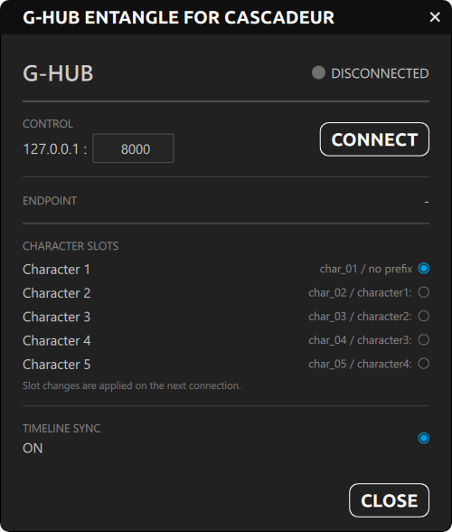
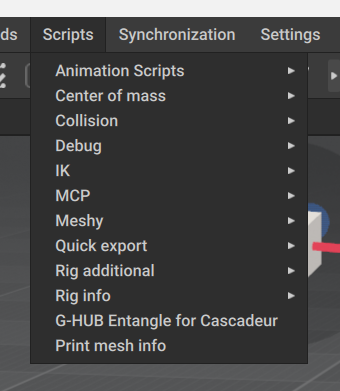
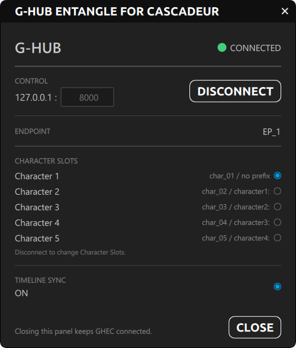

# GHEC — G-HUB Entangle for Cascadeur

**G-HUB Entangle for Cascadeur (GHEC)** is an independent TeamGadget synchronization component designed for use with Cascadeur through G-HUB.

GHEC connects Cascadeur to the **TeamGadget Universal Real-Time Sync System** and provides real-time character synchronization, Character Slot routing, and canonical timeline synchronization.

> GHEC is designed to keep the Cascadeur-side workflow simple: install the component, start G-HUB, connect, and enable the Character Slots you want to use.

---

## Overview

GHEC is the Cascadeur-side component of the TeamGadget synchronization system.

GHEC does **not** communicate directly with Unity, Blender, ShapeMixer Entangle, or other applications.  
All routing and synchronization is handled through **G-HUB**.

```text
Cascadeur / GHEC
       │
       ▼
     G-HUB
      ├── GHEU — G-HUB Entangle for Unity
      ├── GHEB — G-HUB Entangle for Blender
      └── SE   — ShapeMixer Entangle
```



---

## Requirements

### Tested Environment

- **Cascadeur 2026.2.2**
- **Windows 64-bit**
- **G-HUB v1.0**

### Cascadeur License Requirement

GHEC requires a paid Cascadeur license.

Supported Cascadeur license tiers:

- Indie
- Pro
- Teams

The free version of Cascadeur is not supported by GHEC.

---

## Installation

GHEC uses Cascadeur's Python script and Python model directories.

### 1. Install the GHEC script

Copy:

```text
ghec.py
```

to:

```text
<Cascadeur installation folder>/resources/scripts/python/scripts/
```

Example:

```text
C:/Program Files/Cascadeur/resources/scripts/python/scripts/
```

### 2. Install the GHEC model files

Create the following folder if it does not already exist:

```text
<Cascadeur installation folder>/resources/scripts/python/models/ghec/
```

Copy the following files into that folder:

```text
backend.pyc
model.py
view.qml
```

The final structure should look like this:

```text
resources/
└─ scripts/
   └─ python/
      ├─ scripts/
      │  └─ ghec.py
      │
      └─ models/
         └─ ghec/
            ├─ backend.pyc
            ├─ model.py
            └─ view.qml
```

### 3. Launch GHEC

Restart Cascadeur after installing the files.

Open the **Scripts** menu and select:

**G-HUB Entangle for Cascadeur**



> GHEC v1.0 documentation is written for Cascadeur 2026.2.2.

---

## Quick Start

1. Start **G-HUB**.
2. Start **Cascadeur**.
3. From Cascadeur's **Scripts** menu, select **G-HUB Entangle for Cascadeur**.
4. Confirm that the G-HUB Control Port matches G-HUB.
5. Press **CONNECT**.
6. Enable the required Character Slots.
7. Connect the corresponding TeamGadget component.
8. Start synchronization.

Once GHEC is connected, the status changes to **CONNECTED**, the endpoint ID is displayed, and slot changes are locked until you disconnect.



---

## G-HUB Connection

GHEC connects to the G-HUB control plane through the configured Control Port.

Default:

```text
127.0.0.1:8000
```

The default configuration is intended for communication on the same Windows PC.

If the Control Port is changed in G-HUB, enter the same Control Port in GHEC before connecting.

---

## Character Slots

GHEC supports up to **5 Character Slots**.

| GHEC Slot | Channel | G-HUB Prefix |
| --- | --- | --- |
| Character 1 | `char_01` | no prefix |
| Character 2 | `char_02` | `character1:` |
| Character 3 | `char_03` | `character2:` |
| Character 4 | `char_04` | `character3:` |
| Character 5 | `char_05` | `character4:` |

Each selected Character Slot is registered with G-HUB and routed independently.

This allows multiple characters to be synchronized simultaneously while keeping each character's data separated.

> Slot changes are applied on the next connection.

---

## Character Synchronization

GHEC uses an initialization and handshake stage before live streaming begins.

During connection, the character structure required for synchronization is exchanged through G-HUB.

Once the route is ready, live character data is streamed through the assigned G-HUB UDP channel.

### Rig-Agnostic Workflow

The TeamGadget synchronization architecture is designed to avoid user-authored bone mapping where compatible character structures are available on both sides.

The connected applications provide their character structure during initialization, and the destination component resolves its local mapping internally.

This allows the same synchronization workflow to be used across different rig types without requiring a fixed CC-only or humanoid-only pipeline.

Actual compatibility depends on the hierarchy and character data available in the connected applications.

---

## Timeline Synchronization

GHEC can participate in the G-HUB canonical timeline synchronization system.

When **Timeline Sync** is enabled, Cascadeur can exchange timeline state through G-HUB with participating TeamGadget components.

Depending on the connected component, synchronized timeline state can include:

- current frame
- play
- pause
- stop
- scrub / seek
- timeline range
- frame rate

Timeline synchronization is optional.

---

## User Interface

The GHEC window contains the controls required for normal operation.

### G-HUB

Displays the current G-HUB connection state.

- **Control** — G-HUB control address and port
- **CONNECT / DISCONNECT** — Connects or disconnects GHEC from G-HUB
- **Connection Status** — Shows whether GHEC is connected

### Character Slots

Displays Character 1 through Character 5.

Each row shows:

- the Cascadeur-side channel identifier
- the corresponding G-HUB character prefix
- whether the slot is enabled

### Timeline Sync

Controls participation in G-HUB canonical timeline synchronization.

When enabled, GHEC can exchange timeline state with other participating TeamGadget components through G-HUB.

### Close

Closes the GHEC window.

Closing the panel does **not** disconnect GHEC. If GHEC is already connected, it remains connected until you explicitly disconnect it.

---

## Distribution

GHEC uses a mixed distribution model.

### Open-Source Components

The following files are distributed as source:

```text
ghec.py
model.py
view.qml
```

### Compiled Backend

The following component is distributed only in compiled form:

```text
backend.pyc
```

`backend.pyc` contains protected backend functionality, including the Cascadeur license validation used by GHEC.

The compiled backend is **not** part of the open-source portion of GHEC.

---

## Troubleshooting

### GHEC does not appear in Cascadeur

Check that:

- `ghec.py` is installed in the Cascadeur Python `scripts` directory
- `backend.pyc`, `model.py`, and `view.qml` are installed in `models/ghec`
- Cascadeur was restarted after installation
- **G-HUB Entangle for Cascadeur** is being launched from the **Scripts** menu

### GHEC cannot connect to G-HUB

Check that:

- G-HUB is running
- GHEC and G-HUB use the same Control Port
- another application is not already using the configured port
- Windows Firewall or security software is not blocking local communication

### A Character Slot does not synchronize

Check that:

- the Character Slot is enabled in GHEC
- the corresponding destination component is connected to G-HUB
- both applications are using the corresponding Character Slot
- the route is active in G-HUB

### Timeline Sync does not work

Check that:

- GHEC is connected to G-HUB
- Timeline Sync is enabled
- another participating TeamGadget component is connected to the canonical timeline path

---

## License

GHEC uses separate licensing for its open-source and compiled components.

### Open-Source Files

The open-source portion is covered by:

```text
LICENSE
```

### Compiled Backend

The compiled:

```text
backend.pyc
```

component is covered separately by:

```text
EULA.md
```

Users must comply with both documents where applicable.

---

## Third-Party Notice

GHEC is an independent **TeamGadget** project designed for use with Cascadeur.

TeamGadget is not affiliated with, endorsed by, sponsored by, certified by, or officially supported by the developer or owner of Cascadeur.

Cascadeur and related product names and trademarks belong to their respective owners.

---

## Project

**TeamGadget**  
**GHEC — G-HUB Entangle for Cascadeur**
