# GHEU — G-HUB Entangle for Unity

**G-HUB Entangle for Unity (GHEU)** is an independent TeamGadget synchronization component designed for use with Unity through G-HUB.

GHEU connects Unity to the **TeamGadget Universal Real-Time Sync System** and provides real-time body synchronization, facial / BlendShape synchronization, Character Slot routing, canonical timeline synchronization, Smart Swizzle diagnostics, offline facial bake, and animation transfer through the FBX Bridge.

> GHEU keeps normal operation compact in the GHEU Control window, while character-specific and diagnostic settings remain in the Unity Inspector.

---

## Overview

GHEU is the Unity-side endpoint of the TeamGadget synchronization system.

GHEU does **not** communicate directly with Cascadeur, Blender, ShapeMixer Entangle, or other applications.  
All routing and synchronization is handled through **G-HUB**.

```text
Cascadeur / GHEC
       │
       ▼
     G-HUB
       │
       ▼
Unity / GHEU
```

GHEU officially supports both **Humanoid** and **Generic** character workflows.

- **Humanoid**  
  Use this mode for characters that have a valid **Unity Humanoid Avatar** assigned.

  This is the standard choice for humanoid characters configured with Unity's Humanoid animation system.

- **Generic**  
  Use this mode for characters that do **not** use a Unity Humanoid Avatar.

  This includes non-humanoid bone-driven characters such as creatures, quadrupeds, mechanical characters, and other custom rigs.

  Humanoid-shaped characters can also use Generic mode when they are configured as Generic rather than using a Unity Humanoid Avatar.

This means GHEU is not limited to humanoid characters.

Actual synchronization compatibility still depends on the character hierarchy, bone names, reference pose, and transform structure available in both Cascadeur and Unity.

This includes non-humanoid bone-driven characters where the connected character structures are compatible.

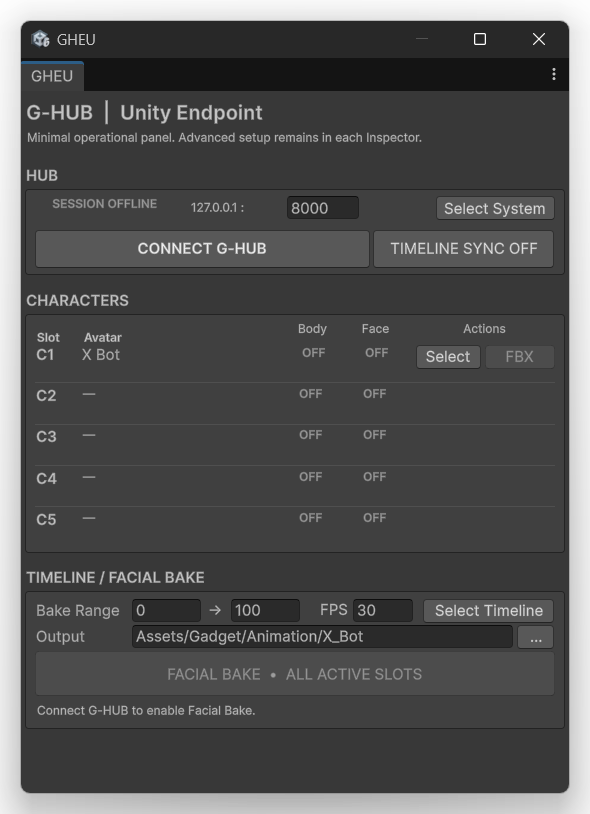

---

## Development / Tested Environment

GHEU v1.0 was developed and validated in the following Unity 6 range:

- **Unity 6.3 LTS – 6.6**
- Windows 64-bit

Validated editor versions include:

- **Unity 6000.3.8f1**
- **Unity 6000.6.0f1**

Related TeamGadget environment used during validation:

- **G-HUB v1.0**
- **Cascadeur 2026.2.2 — Windows 64-bit**

> Versions outside the tested Unity 6.3 LTS – 6.6 range are not guaranteed by GHEU v1.0.

---

## Distribution

GHEU v1.0 is distributed as a Unity package:

```text
GHEU_v1.0_6.3LTS-6.6.unitypackage
```

Import the package into the Unity project that will receive synchronization data.

---

# Installation

## 1. Import the Unity Package

Import:

```text
GHEU_v1.0_6.3LTS-6.6.unitypackage
```

into your Unity project.

After import, the GHEU runtime scripts are installed under the TeamGadget G-HUB directory.

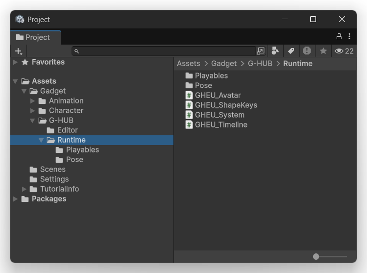

Core runtime components include:

- `GHEU_Avatar`
- `GHEU_ShapeKeys`
- `GHEU_System`
- `GHEU_Timeline`

Additional Playables and Pose-related runtime files are included in their respective folders.

---

## 2. Create the Scene Components

GHEU includes several internal runtime and editor scripts, but users normally interact with only the following four components:

- `GHEU_System.cs`
- `GHEU_Timeline.cs`
- `GHEU_Avatar.cs`
- `GHEU_ShapeKeys.cs`

The other GHEU scripts are internal support components and normally do not need to be added or configured manually.

### 2.1 Create the GHEU System Object

1. In the Unity **Hierarchy**, create an empty GameObject.
2. Attach `GHEU_System.cs` to the GameObject by dragging and dropping the script onto it, or by using **Add Component**.
3. The GameObject name can be changed freely.

Example:

```text
GHEU_System
```

`GHEU_System` manages the Unity endpoint connection to G-HUB.

---

### 2.2 Create the GHEU Timeline Object

1. In the Unity **Hierarchy**, create another empty GameObject.
2. Attach `GHEU_Timeline.cs` to the GameObject by dragging and dropping the script onto it, or by using **Add Component**.
3. The GameObject name can be changed freely.

When `GHEU_Timeline.cs` is attached, the GameObject is automatically configured with the Unity `PlayableDirector` functionality required by GHEU.

Example:

```text
GHEU_Timeline
```

`GHEU_Timeline` manages Timeline-related bake settings and multi-character facial bake.

---

### 2.3 Add Body Synchronization to the Character

Select the imported character in the Unity **Hierarchy** and attach:

```text
GHEU_Avatar.cs
```

`GHEU_Avatar` is required for body synchronization.

It manages:

- Character Slot assignment
- Humanoid / Generic selection
- Root Motion settings
- Root Swizzle
- Interpolation
- Smart Swizzle
- FBX Bridge

---

### 2.4 Add Facial Synchronization if Required

If facial / BlendShape synchronization is also required, attach:

```text
GHEU_ShapeKeys.cs
```

to the same character.

`GHEU_ShapeKeys` is optional.

It is only required when the character uses facial / BlendShape synchronization or Facial Bake.

---

### Typical Scene Setup

A typical scene looks like this:

```text
SampleScene
├─ Main Camera
├─ Directional Light
├─ Global Volume
├─ GHEU_System
├─ GHEU_Timeline
└─ Character
   ├─ GHEU_Avatar
   └─ GHEU_ShapeKeys   (optional)
```

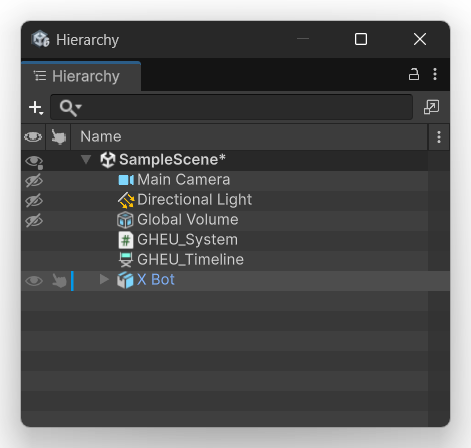

> For normal GHEU operation, users only need to work directly with these four scripts:
>
> - `GHEU_System.cs`
> - `GHEU_Timeline.cs`
> - `GHEU_Avatar.cs`
> - `GHEU_ShapeKeys.cs`
>
> Other GHEU scripts are support components and normally do not need to be attached or configured manually.

---

## 3. Open the GHEU Tools

Use the Unity Editor menu:

```text
Gadget
└─ G-HUB
   ├─ GHEU Control
   └─ SS Visualizer
```

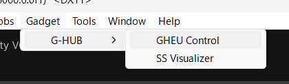

- **GHEU Control** opens the compact operational window.
- **SS Visualizer** opens the Smart Swizzle diagnostic visualizer.

---

# Character Setup Requirements

Before starting body synchronization, prepare the character in both Cascadeur and Unity.

## 1. Use the Same Character

Prepare the same character in both **Cascadeur** and **Unity**.

GHEU synchronizes the corresponding bone structure between the source character in Cascadeur and the destination character in Unity.

---

## 2. Use a Matching Reference Pose

Before the initial synchronization, both characters should be placed in the same reference pose.

Recommended reference poses are:

- **T-pose**
- **A-pose**

Use the same pose on both sides.

For example, do not use a T-pose in Cascadeur while the Unity character is in an A-pose.

The reference pose is important because GHEU uses it during the Smart Swizzle / reference-pose initialization process.

---

## 3. Bone Hierarchy and Bone Names Must Match

The Cascadeur and Unity characters must use the same corresponding:

- bone hierarchy
- bone structure
- bone names

GHEU is designed to remove the need for manual user-authored bone mapping, but it still requires compatible character structures on both sides.

The same bone should represent the same part of the character in both Cascadeur and Unity.

---

## 4. GHEU Is Not Limited to Humanoid Characters

GHEU is not limited to Unity Humanoid rigs.

GHEU v1.0 officially supports:

- **Humanoid**
- **Generic**

This allows synchronization of non-humanoid bone-driven characters as well.

Examples may include:

- quadrupeds
- creatures
- mechanical characters
- other custom bone-driven rigs

However, **not every possible rig can be guaranteed to synchronize correctly**.

Successful synchronization depends on factors including:

- matching bone hierarchy
- matching bone names
- compatible reference poses
- compatible transform structures
- the character data available in both applications

If a character does not synchronize as expected, use the **SS Visualizer** to inspect the Smart Swizzle / reference-pose pipeline.

# Quick Start — Body Synchronization

1. Start **G-HUB**.
2. Start **Cascadeur** and connect **G-HUB Entangle for Cascadeur (GHEC)**.
3. Open the Unity project containing GHEU.
4. Add or select the scene `GHEU_System`.
5. Add `GHEU_Avatar` to the character.
6. Assign the required **Character Slot**.
7. Select the correct **Rig Type**: `Humanoid` or `Generic`.
8. Enable **Body Sync Enabled**.
9. Open **Gadget > G-HUB > GHEU Control**.
10. Press **CONNECT G-HUB**.
11. Confirm that the matching Character route becomes active.
12. Enable **TIMELINE SYNC** if required.

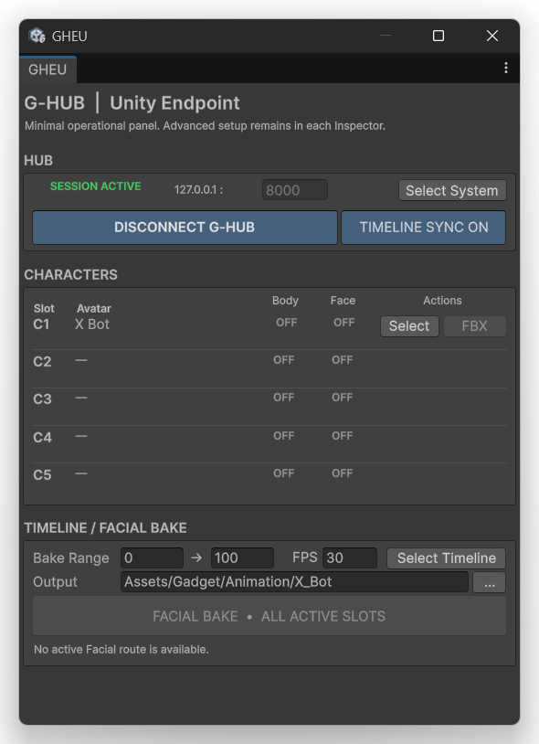

---

# GHEU Control Window

The GHEU Control window is intended for normal day-to-day operation.

It is deliberately compact so it can be docked into a narrow Unity Editor area.

## HUB

The HUB section shows the active G-HUB session.

Offline state:

- `SESSION OFFLINE`
- `CONNECT G-HUB`
- `TIMELINE SYNC OFF`

Connected state:

- `SESSION ACTIVE`
- `DISCONNECT G-HUB`
- `TIMELINE SYNC ON`

The window also shows:

- Host
- Control Port
- **Select System**

`Select System` selects the `GHEU_System` instance used by the Control window.

---

## CHARACTERS

GHEU supports up to **5 Character Slots**:

- C1
- C2
- C3
- C4
- C5

Each row shows:

- **Slot**
- **Avatar**
- **Body**
- **Face**
- **Actions**

Actions can include:

- **Select** — selects the assigned character in Unity
- **FBX** — starts the FBX Bridge workflow when available

Body and Face states indicate whether the corresponding G-HUB route is active.

---

## TIMELINE / FACIAL BAKE

The lower section provides shared Timeline and Facial Bake controls:

- Bake Range
- FPS
- Select Timeline
- Output Folder
- Facial Bake

`FACIAL BAKE - ALL ACTIVE SLOTS` is enabled only when valid active facial routes are available.

---

# GHEU_System

`GHEU_System` contains the Unity endpoint connection settings.

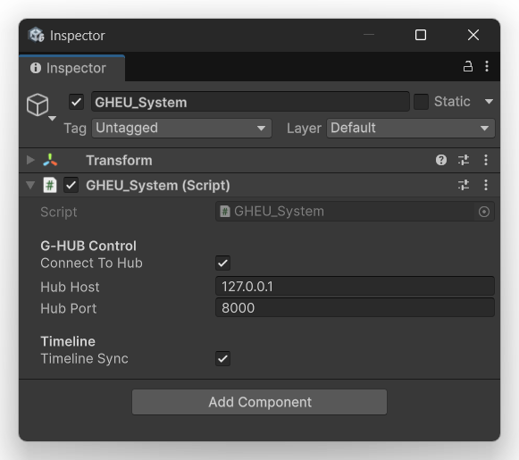

## G-HUB Control

### Connect To Hub

Enables the G-HUB connection workflow for this system.

### Hub Host

Default:

```text
127.0.0.1
```

The normal GHEU workflow is intended for local communication on the same Windows PC.

### Hub Port

Default:

```text
8000
```

The GHEU Hub Port must match the G-HUB Control Port.

---

## Timeline

### Timeline Sync

Enables participation in the G-HUB canonical timeline synchronization system.

This setting is also exposed from the GHEU Control window.

---

# GHEU_Avatar

`GHEU_Avatar` is the primary body synchronization component attached to the Unity character.

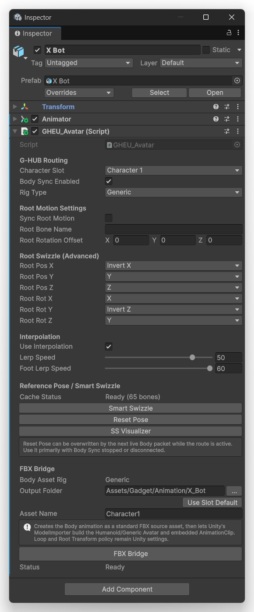

---

## G-HUB Routing

### Character Slot

Assigns the character to one of the G-HUB Character Slots:

- Character 1
- Character 2
- Character 3
- Character 4
- Character 5

The corresponding Cascadeur character must use the matching Character Slot.

### Body Sync Enabled

Enables or disables body synchronization for this character.

### Rig Type

Supported values:

- **Humanoid**
- **Generic**

Both are officially supported by GHEU v1.0.

---

# Root Motion Settings

Root Motion synchronization is optional.

## Sync Root Motion

Enables root-bone translation and rotation synchronization.

When disabled, GHEU synchronizes the mapped body pose without applying the configured root-motion path.

## Root Bone Name

Enter the root bone used by the character when Root Motion synchronization is enabled.

## Root Rotation Offset

Applies a rotation offset when the Unity character root orientation differs from the source coordinate system.

This is useful when the model import orientation and Cascadeur root orientation do not match directly.

---

# Root Swizzle (Advanced)

Root Swizzle remaps root translation and rotation axes.

Available controls:

- Root Pos X
- Root Pos Y
- Root Pos Z
- Root Rot X
- Root Rot Y
- Root Rot Z

Each character can require a different mapping depending on its imported coordinate system and root hierarchy.

> Root Swizzle is an advanced adjustment. Do not change it unless the root translation or rotation behaves incorrectly.

---

# Interpolation

Incoming body motion can be smoothed using interpolation.

## Use Interpolation

Enables body interpolation.

## Lerp Speed

Controls general body interpolation speed.

## Foot Lerp Speed

Controls foot interpolation independently.

This allows the foot response to be tuned separately from the rest of the character.

---

# Reference Pose / Smart Swizzle

GHEU uses a cached reference-pose workflow for rig-agnostic body synchronization.

When a character route becomes active for the first time, GHEU captures the current Unity reference pose and requests the corresponding Cascadeur reference-pose data.

The resulting cache can be reused on later compatible connections.

## Cache Status

Examples:

```text
Missing
Ready (65 bones)
Ready (100 bones)
```

`Ready` indicates that the reference cache is available for the mapped character.

## Smart Swizzle

Starts or refreshes the Smart Swizzle reference process when required.

## Reset Pose

Restores the cached reference pose.

> A Reset Pose result can be overwritten by the next incoming live Body packet while the Body route is active. Use it primarily while Body Sync is stopped or disconnected.

## SS Visualizer

Opens the Smart Swizzle diagnostic visualizer for the selected character.

---

# Smart Swizzle Visualizer

The **SS Visualizer** is a diagnostic tool for inspecting the reference-pose and mapping pipeline.

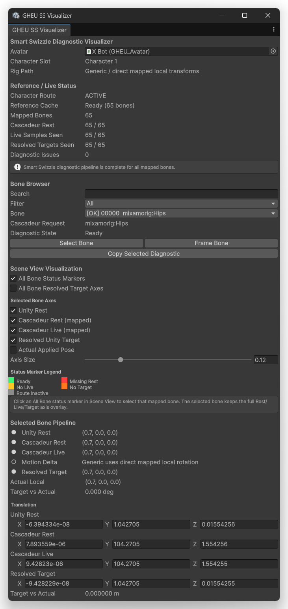

It is primarily intended for:

- diagnosing rigs that do not synchronize correctly
- checking whether the reference-pose pipeline completed
- confirming per-bone mapping
- inspecting orientation / axis differences
- identifying missing Rest, Live, or target data

Normal synchronization does not require the SS Visualizer once a character is working correctly.

---

## Reference / Live Status

The status section includes:

### Character Route

Shows whether the selected character route is active.

### Reference Cache

Shows the current cached reference-pose state.

### Mapped Bones

Number of bones currently mapped.

### Cascadeur Rest

Shows how many mapped bones received Cascadeur reference-pose data.

### Live Samples Seen

Shows how many mapped bones have received live body samples.

### Resolved Targets Seen

Shows how many Unity target bones were resolved.

### Diagnostic Issues

Displays the number of detected Smart Swizzle diagnostic issues.

When the complete pipeline is available, the Visualizer reports that the diagnostic pipeline is complete for all mapped bones.

---

## Bone Browser

The Bone Browser provides:

- Search
- Filter
- Bone selection
- Cascadeur Request name
- Diagnostic State
- Select Bone
- Frame Bone
- Copy Selected Diagnostic

This allows a problematic bone to be inspected individually.

---

## Scene View Visualization

The Visualizer can display diagnostic markers and axes directly in the Unity Scene View.

Options include:

- All Bone Status Markers
- All Bone Resolved Target Axes

For the selected bone:

- Unity Rest
- Cascadeur Rest (mapped)
- Cascadeur Live (mapped)
- Resolved Unity Target
- Actual Applied Pose

Axis Size controls the Scene View visualization scale.

---

## Status Marker Legend

Marker colors indicate states such as:

- Ready
- No Live
- Route Inactive
- Missing Rest
- No Target

Use these markers to quickly locate incomplete sections of the synchronization pipeline.

---

## Selected Bone Pipeline

For the selected bone, the Visualizer can show:

- Unity Rest
- Cascadeur Rest
- Cascadeur Live
- Motion Delta / mapping mode
- Resolved Target
- Actual Local
- Target vs Actual

Translation and orientation values are shown numerically for deeper diagnosis.

---

# Rig-Agnostic Synchronization

GHEU is designed to avoid manual user-authored bone mapping for compatible character structures.

Character structure and reference-pose information are exchanged through the G-HUB connection workflow, and GHEU resolves the Unity-side target mapping internally.

The same architecture is used for both supported Rig Types:

- Humanoid
- Generic

This allows GHEU to support conventional humanoids as well as non-humanoid bone-driven characters.

Actual compatibility still depends on the hierarchy and transform data available in both connected applications.

---

# Humanoid Workflow

Humanoid is officially supported.

Recommended setup:

1. Set `Rig Type` to **Humanoid**.
2. Ensure the Unity model has a valid Humanoid Avatar.
3. Enable Body Sync.
4. Configure Root Motion only when required.
5. Connect the matching GHEC Character Slot.
6. Use Smart Swizzle diagnostics if the result is incorrect.
7. Use the FBX Bridge for offline body animation transfer.

GHEU uses Unity's ModelImporter workflow when preparing the resulting Humanoid animation asset.

---

# Generic Workflow

Generic is officially supported.

Recommended setup:

1. Set `Rig Type` to **Generic**.
2. Enable Body Sync.
3. Configure Root Motion / Root Swizzle only when required by the character.
4. Connect the matching GHEC Character Slot.
5. Use the SS Visualizer when diagnosing orientation or reference-pose problems.
6. Use the FBX Bridge for offline body animation transfer.

Generic support is not limited to humanoid-shaped characters.

Non-humanoid rigs can be synchronized when the character structure is compatible with the source character.

---

# FBX Bridge

The FBX Bridge creates the body animation as a standard FBX source asset, then allows Unity's ModelImporter to build the Humanoid or Generic Avatar and embedded AnimationClip.

Main controls in `GHEU_Avatar`:

- Body Asset Rig
- Output Folder
- Use Slot Default
- Asset Name
- FBX Bridge
- Status

---

## Body Asset Rig

Shows the selected body asset rig mode:

- Humanoid
- Generic

This follows the active GHEU character workflow.

## Output Folder

Specifies where the generated body animation asset will be created.

Use the `...` button to choose the Unity project folder.

## Use Slot Default

Restores the default output folder associated with the current Character Slot.

## Asset Name

Sets the generated animation asset name.

## FBX Bridge

Starts the animation transfer / import workflow.

The Character route must be active before export.

## Status

Shows FBX Bridge state and the last completed export information.

> Animation Clip Loop and Root Transform policies remain Unity settings after import.

---

# GHEU_ShapeKeys

`GHEU_ShapeKeys` enables facial / BlendShape synchronization.

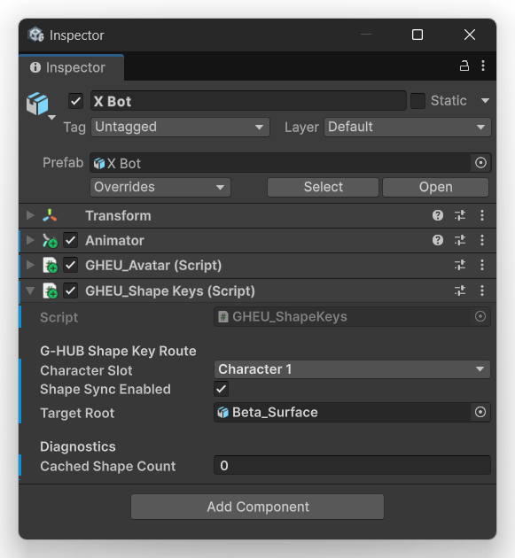

---

## G-HUB Shape Key Route

### Character Slot

Assigns facial synchronization to one of the G-HUB Character Slots.

The facial Character Slot should correspond to the intended character.

### Shape Sync Enabled

Enables or disables facial / BlendShape synchronization.

### Target Root

Defines the target object hierarchy used for the character's facial / BlendShape route.

---

## Diagnostics

### Cached Shape Count

Shows the number of shape keys currently cached by GHEU for the target character.

---

# Timeline Setup

GHEU uses a `GHEU_Timeline` scene object together with a Unity `PlayableDirector`.

Example Timeline:

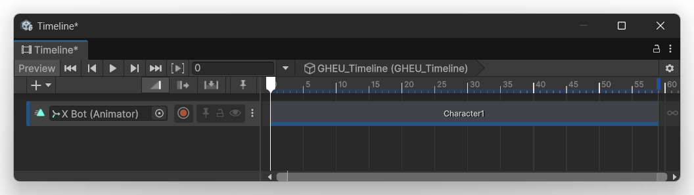

A typical Timeline track can contain the animation clip produced by the body FBX Bridge.

---

# GHEU_Timeline

`GHEU_Timeline` contains bake settings and the multi-character facial bake controls.

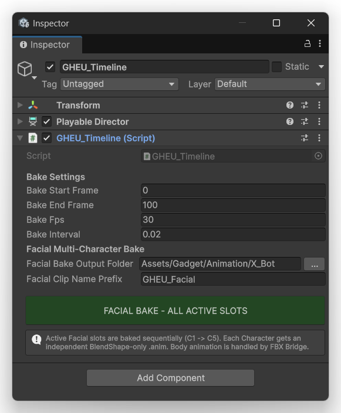

---

## Bake Settings

### Bake Start Frame

First frame included in the facial bake.

### Bake End Frame

Last frame included in the facial bake.

### Bake Fps

Frame rate used for the bake.

### Bake Interval

Sampling interval used by the bake process.

---

# Facial Multi-Character Bake

## Facial Bake Output Folder

Destination folder for generated facial animation clips.

Use the `...` button to browse for the output folder.

## Facial Clip Name Prefix

Prefix used for generated facial animation clip names.

## FACIAL BAKE - ALL ACTIVE SLOTS

Starts facial bake for all active facial Character Slots.

Operational rules:

- only active facial Character Slots are baked
- slots are processed sequentially from **C1 to C5**
- each character receives an independent **BlendShape-only AnimationClip**
- only shape keys present in the incoming bake stream are included
- body animation is handled separately by the **FBX Bridge**

This separation keeps body and facial animation assets independent.

---

# Canonical Timeline Synchronization

GHEU can participate in the G-HUB canonical timeline system.

Timeline synchronization can include:

- current frame
- play
- pause
- stop
- scrub / seek
- timeline range
- frame rate

Timeline Sync can be controlled from:

- `GHEU_System`
- GHEU Control window

---

# Animator Interaction

Unity's `Animator` and GHEU can both attempt to write to the same character transforms.

If the character shakes, fights the incoming pose, or does not remain stable during live synchronization, check whether the Animator is also controlling the same bones.

For live synchronization, remove or disable conflicting animation ownership as appropriate for the workflow.

---

# Character Structure Requirements

GHEU's rig-agnostic workflow removes normal user-authored bone mapping, but the source and destination character structures still need to be compatible.

Where direct correspondence is expected, matching hierarchy and bone naming are important.

GHEU uses 16-bit Bone IDs.

The current GHEU v1.0 transport supports up to **2,112 bone entries per synchronized character** due to the single-datagram UDP payload limit.

The underlying Bone ID and bone-count fields use 16-bit values, but packet splitting is not implemented in v1.0.

---

# Troubleshooting

## GHEU cannot connect to G-HUB

Check that:

- G-HUB is running
- `Hub Host` is correct
- GHEU and G-HUB use the same Control Port
- the intended `GHEU_System` is selected
- Windows Firewall or security software is not blocking local communication

---

## Body route remains OFF

Check that:

- `GHEU_Avatar` is attached to the intended character
- the correct Character Slot is selected
- **Body Sync Enabled** is enabled
- GHEC is connected
- the corresponding Cascadeur Character Slot is selected
- the route exists in G-HUB

---

## Face route remains OFF

Check that:

- `GHEU_ShapeKeys` is attached
- the correct Character Slot is selected
- **Shape Sync Enabled** is enabled
- Target Root is correct
- the facial source is active
- the corresponding G-HUB route exists

---

## Character shakes during synchronization

Check whether:

- Animator is writing to the same transforms
- another animation system is controlling the character
- interpolation settings are appropriate

---

## Smart Swizzle cache shows Missing

Establish the Character route while the Unity character is in the intended reference pose.

If the cache still does not become Ready:

1. open **SS Visualizer**
2. check Character Route
3. check Cascadeur Rest coverage
4. check Live Samples Seen
5. check Resolved Targets Seen
6. inspect Diagnostic Issues

---

## Generic character orientation is incorrect

Check:

- Root Rotation Offset
- Root Swizzle
- root hierarchy
- SS Visualizer per-bone diagnostics

---

## FBX Bridge cannot run

Check that:

- G-HUB is connected
- the Character route is active
- Output Folder is valid
- Rig Type matches the character
- Asset Name is valid

---

## Facial Bake button is disabled

Check that:

- G-HUB is connected
- at least one facial route is active
- `GHEU_ShapeKeys` is enabled for the intended character
- the intended Timeline has been selected

---

# Open Source

The Unity-side GHEU source code is intended to be released as open source.

The applicable license is included with the GHEU release.

---

# Third-Party Notice

GHEU is an independent **TeamGadget** project designed for use with Unity.

TeamGadget is not affiliated with, endorsed by, sponsored by, certified by, or officially supported by Unity Technologies or the developer or owner of Unity.

Unity and related product names and trademarks belong to their respective owners.

GHEU interoperates with other third-party applications only through the TeamGadget G-HUB architecture. References to third-party products are made solely for compatibility and interoperability identification.

---

# Project

**TeamGadget**  
**GHEU — G-HUB Entangle for Unity**
