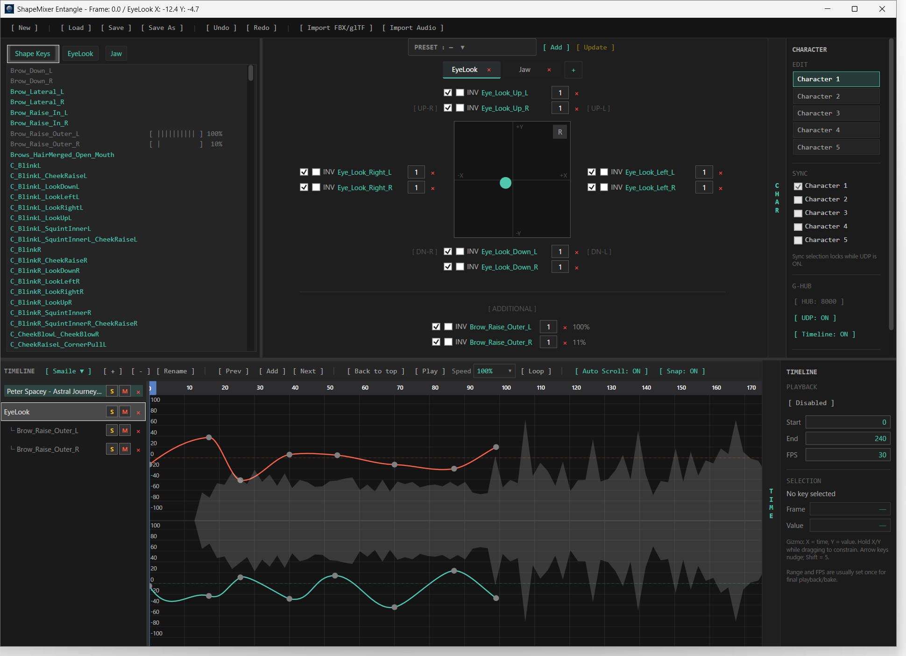
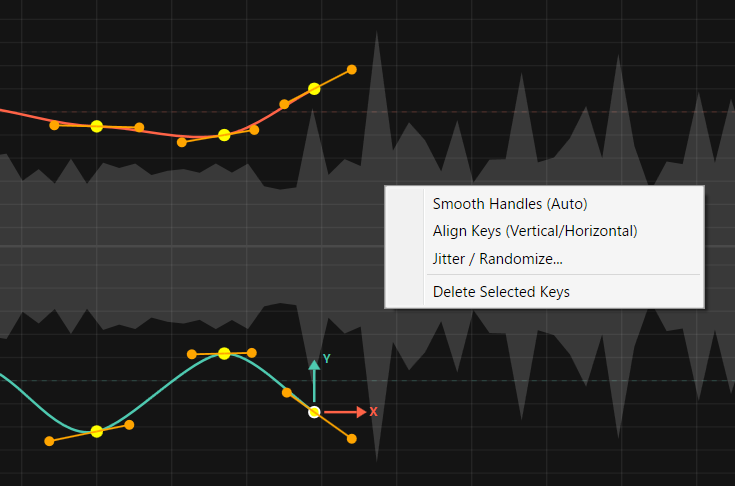

# ShapeMixer Entangle v1.0

**Facial / Shape Key Authoring Endpoint**

**ShapeMixer Entangle (SE)** is an independent TeamGadget facial-animation and Shape Key authoring tool designed to work through **G-HUB**.

SE imports Shape Keys / morph targets from FBX or glTF assets, provides layered XY-pad mixing, presets, a Bezier timeline editor, reference-audio playback, multi-character routing, and real-time Shape Key publishing to compatible TeamGadget endpoints.

It also acts as the facial-animation source for the **GHEU Offline Facial Bake** workflow.

> SE separates editing from live routing: you can edit one Character Slot while independently choosing which Character Slots participate in G-HUB synchronization.

---

## Overview

SE is a facial-animation authoring endpoint in the **TeamGadget Universal Real-Time Sync System**.

SE does **not** communicate directly with Unity, Blender, Cascadeur, or other applications.  
Live Shape Key data, timeline state, route ownership, and Offline Bake requests are handled through **G-HUB**.

```text
ShapeMixer Entangle / SE
          │
          ▼
        G-HUB
          │
          ├── GHEU — G-HUB Entangle for Unity
          └── GHEB — G-HUB Entangle for Blender
```

SE supports up to **5 Character Slots**.

Each Character Slot owns its own:

- imported Shape Key set
- XY-pad layers
- additional Shape Key assignments
- presets
- timeline tracks
- graph-editor state
- G-HUB facial route



---

## Features

- Real-time Shape Key / BlendShape publishing through G-HUB
- Up to **5 Character Slots**
- Independent **EDIT** and **SYNC** Character selection
- FBX / glTF Shape Key import
- Layered XY-pad facial mixing
- Directional Shape Key assignment
- Additional Shape Key controls
- Per-assignment enable, inversion, and multiplier controls
- Preset creation and update
- Multi-take animation workflow
- Bezier animation-curve editor
- Timeline playback, looping, range, FPS, snapping, and auto-scroll controls
- WAV / MP3 reference-audio import
- Audio waveform display
- Audio offset, mute, solo, and volume controls
- Undo / Redo
- Project save / load using `.sme`
- Canonical G-HUB Timeline synchronization
- Automatic response to GHEU Offline Facial Bake requests
- Keyboard shortcuts for common timeline and editing operations

---

## System Requirements

- **Windows 64-bit**
- **G-HUB v1.0**
- A compatible TeamGadget destination endpoint for live facial synchronization
- For Unity Offline Facial Bake: **GHEU v1.0**

SE v1.0 is distributed as a prebuilt Windows application.

No installer is required.

---

## Distribution

SE v1.0 is distributed as a portable ZIP archive:

```text
ShapeMixer_Entangle_v1.0_Windows_x64.zip
```

Extract the archive to a writable folder and keep all included files together.

The SE source code is not part of the public binary distribution.

---

# Installation

1. Download:

```text
ShapeMixer_Entangle_v1.0_Windows_x64.zip
```

2. Extract the ZIP archive.

3. Run:

```text
ShapeMixerEntangle.exe
```

4. Start **G-HUB** before enabling live Shape Key output or Timeline Sync.

---

# Quick Start

1. Start **G-HUB**.
2. Launch **ShapeMixer Entangle**.
3. Import an FBX or glTF character asset with Shape Keys / morph targets.
4. Select the Character Slot you want to edit in the **EDIT** panel.
5. Assign Shape Keys to XY-pad directions or **ADDITIONAL** controls.
6. Create animation keys or presets as required.
7. Enable the intended Character Slot in the **SYNC** panel.
8. Press **UDP: OFF** to switch live Shape Key publishing to **ON**.
9. Connect the matching Character Slot on the destination TeamGadget endpoint.
10. Enable **Timeline: ON** when canonical timeline synchronization is required.

> SYNC selection is locked while UDP publishing is active. Turn UDP OFF before changing which Character Slots participate in live synchronization.

---

# Main Window

The SE interface is divided into four main working areas:

- Shape Key list and tabs on the left
- Pad / preset authoring area in the center
- Character, G-HUB, and Timeline controls on the right
- Timeline and Bezier curve editor across the bottom

The layout is designed so the current facial controls, animation curve, audio waveform, and G-HUB state can be viewed together.

---

# Character Slots

SE supports:

```text
Character 1
Character 2
Character 3
Character 4
Character 5
```

Each Character Slot has independent facial-authoring data and an independent G-HUB facial route.

## EDIT

The **EDIT** selection chooses which Character Slot is currently being edited.

Changing the EDIT Character does not by itself enable or disable live synchronization.

## SYNC

The **SYNC** selection chooses which Character Slots participate in G-HUB Shape Key routing.

Multiple Character Slots can be enabled for synchronization at the same time.

Character 1 participates by default in a new project. Characters 2–5 can be enabled when required.

When UDP publishing is ON, the SYNC selection is locked to prevent route configuration from changing during active transmission.

---

# G-HUB Connection

The right-side G-HUB controls include:

```text
[ HUB: 8000 ]
[ UDP: OFF ]
[ Timeline: OFF ]
```

## Control Port

Default:

```text
8000
```

The SE Control Port must match the G-HUB Control Port.

SE only requires the G-HUB Control Port.  
Live UDP data ports are allocated by G-HUB automatically.

Normal operation is intended for communication on the same Windows PC.

## UDP

`UDP: ON` enables live Shape Key publishing for the selected SYNC Character Slots.

When a compatible destination endpoint connects with the matching Character Slot, G-HUB creates the facial route and assigns the required data channel automatically.

## Timeline

`Timeline: ON` enables participation in the G-HUB canonical timeline system.

Timeline Sync is independent from live Shape Key UDP publishing.

---

# Importing Shape Keys

Use:

```text
[ Import FBX/glTF ]
```

to load Shape Key / morph-target names from a supported FBX or glTF asset.

SE uses the imported Shape Key structure for facial authoring and G-HUB output.

Importing a model does not create a 3D preview inside SE.  
The imported asset is used as the source of the Shape Key structure.

If no valid Shape Keys are found, SE keeps the current Shape Key setup instead of replacing it with an empty one.

---

# Shape Key Controls

The Shape Key list shows the available imported facial targets for the active Character Slot.

Shape Keys can be used in three main ways:

- assigned to XY-pad directions
- assigned to the **ADDITIONAL** section
- animated directly on the Timeline

Shape Key values are evaluated together to produce the final facial state.

---

# XY Pad

SE uses layered XY pads for expression control.

A pad can contain Shape Key assignments in the following zones:

```text
UP
DOWN
LEFT
RIGHT
UP-LEFT
UP-RIGHT
DOWN-LEFT
DOWN-RIGHT
ADDITIONAL
```

Drag Shape Keys from the Shape Key list into the required zone.

Multiple Shape Keys can be assigned to the same direction.

The pad combines the assigned Shape Keys according to the puck position and assignment settings.

---

## Assignment Controls

Each assignment can expose controls such as:

- Enable
- INV
- Multiplier
- Current value

These controls allow a pad direction to drive multiple facial targets with different response directions and strengths.

---

# Pad Layers

Multiple pad layers can be created.

Each layer can represent a facial-control group such as:

```text
EYE
BROW
MOUTH
CUSTOM
```

Layer names can be changed freely.

This allows a large facial rig to be divided into smaller, focused control groups.

---

# Presets

SE supports presets for the current pad configuration.

Use the preset controls to:

- create a preset
- apply a preset
- update an existing preset
- rename or remove presets through the available preset controls

Presets store the authored facial-control state for quick recall.

---

# Timeline

The lower area contains SE's animation Timeline and Bezier curve editor.

The Timeline supports:

- multiple Takes
- Shape Key tracks
- XY-pad tracks
- audio tracks
- previous / add / next key navigation
- play / pause
- playback speed
- loop playback
- auto-scroll
- snap
- playback range
- configurable FPS
- graph-track selection
- preset stamping from the timeline head context menu

The current facial result is evaluated from the Timeline and the active Character Slot's authoring data.

The Timeline area is designed as the main animation workspace. From here you can switch Takes, choose the track to edit, preview waveform timing, move through keys, and open graph-editing operations without leaving the current Character Slot.

## Timeline Head / Ruler Operations

The Timeline head indicates the current frame.

From the Timeline controls you can:

- jump to the previous key
- add a key at the current frame
- jump to the next key
- play or pause playback
- enable or disable loop playback
- change playback speed
- enable or disable auto-scroll
- enable or disable snapping
- adjust Start / End / FPS values

In addition, the Timeline head / ruler supports **right-click preset stamping**.

Preset stamping allows you to place a preset event at the current frame directly from the Timeline context workflow, which is useful when blocking or timing facial states without manually re-building the same pose each time.

---

# Takes

SE supports multiple animation **Takes** inside one `.sme` project.

You can:

- create a Take
- remove a Take
- rename a Take
- switch between Takes

Each Take stores its own animation-track data.

Graph-editor settings are retained for the corresponding Take and Character context.

---

# Bezier Curve Editor

Shape Key and pad animation can be edited with Bezier curves.

The selected graph track is displayed together with the Timeline playhead, the current frame, and the reference-audio waveform when audio is present.



The Bezier Curve Editor is one of SE's main authoring tools.
It is intended for fine facial timing, expression shaping, cleanup work, and detailed adjustment after rough performance blocking has been created with pads, presets, or direct key placement.

## Core Editing Behavior

The graph editor supports operations including:

- key selection
- key dragging
- Bezier tangent / handle editing
- copy / paste
- delete
- alignment and curve-editing operations
- snapping
- frame-range display
- waveform-assisted timing adjustment

You can edit both timing and value directly in the graph.
The horizontal axis represents **time / frame**, and the vertical axis represents **value**.
This makes the editor suitable both for ordinary Shape Key curves and for the child curves generated from XY-pad or additional facial controls.

## Tangent Handles and Gizmo

When a key is selected, SE exposes Bezier handles for detailed curve editing.

This allows you to:

- refine ease-in / ease-out timing
- soften abrupt transitions
- sharpen facial accents
- reshape interpolation between neighboring keys

The editor also displays a local graph-editing gizmo so the user can read the working axes directly:

- **X** = time
- **Y** = value

This is especially useful while adjusting handle direction and spacing, because it makes it visually clear whether you are changing timing, amplitude, or both.

## Right-Click Key Editing Menu

Right-clicking in the graph provides quick editing operations for the selected keys.

The current context workflow includes commands such as:

- **Smooth Handles (Auto)**
- **Align Keys (Vertical/Horizontal)**
- **Jitter / Randomize...**
- **Delete Selected Keys**

### Smooth Handles (Auto)

Automatically smooths the selected keys' Bezier handles.
This is useful when a curve has become uneven during manual editing and you want to restore cleaner interpolation quickly.

### Align Keys (Vertical/Horizontal)

Alignment tools make it easier to normalize groups of keys.

- **Vertical alignment** is useful when several keys should share the same value.
- **Horizontal alignment** is useful when several keys should share the same frame.

These operations are convenient for cleanup, rhythmic facial beats, phoneme timing, and blocking passes.

### Jitter / Randomize...

Adds controlled variation to the selected keys.
This can be useful for subtle facial irregularity, texture, or breaking up overly mechanical repetition.

### Delete Selected Keys

Deletes the currently selected keys from the active graph track.

## Relationship to Timeline and Presets

The graph editor is tightly connected to the Timeline workflow.
A common SE workflow is:

1. block a facial pose with the XY pad or a preset,
2. place or stamp that state on the Timeline,
3. then refine the resulting motion in the Bezier Curve Editor.

Because the Timeline head also supports **preset stamping by right-click workflow**, presets are not limited to one-time pose recall.
They can also be used as timed animation-building elements and then polished in the graph editor.

## Practical Use

The Bezier Curve Editor is especially useful for:

- lip and mouth timing cleanup
- brow emphasis and asymmetry polishing
- eye motion shaping
- smoothing transitions between expressions
- tightening beats against dialogue or music
- refining data before GHEU Offline Facial Bake

---

# Reference Audio

Use:

```text
[ Import Audio ]
```

to import reference audio.

Supported audio file types:

```text
WAV
MP3
```

SE displays a waveform in the Timeline and supports audio controls including:

- offset
- volume
- mute
- solo
- playback synchronized to the Timeline

Audio files are referenced by the project; the source audio file itself is not embedded into the `.sme` project file.

If a referenced audio file is unavailable when a project is loaded, SE keeps the audio-track information instead of silently deleting the track.

---

# Project Files

SE project files use:

```text
.sme
```

The project stores authoring state including Character Slot data, Shape Key setup, pads, presets, Takes, animation curves, Timeline settings, and audio-track references.

Use the top menu:

```text
[ New ] [ Load ] [ Save ] [ Save As ]
```

for project management.

---

# Undo / Redo

SE provides normal editing history through:

```text
[ Undo ]
[ Redo ]
```

Common edit operations are grouped so interactive drags behave as a single user operation rather than generating an excessive number of history entries.

---

# Canonical Timeline Synchronization

SE can participate in the G-HUB canonical timeline system.

When Timeline Sync is enabled, supported state can include:

- current timeline time / frame
- play
- pause
- stop
- scrub / seek
- playback range
- frame rate

SE can act as the active timeline owner or follow timeline state received through G-HUB.

Timeline synchronization remains independent from live facial UDP output.

---

# Live Facial Synchronization

Live facial output uses the Character Slots selected in the **SYNC** panel.

For each enabled Character Slot, SE maintains an independent facial route through G-HUB.

Only Shape Key values that change need to be sent during normal live operation, while route establishment and reconnection logic restore the authoritative current state when needed.

The destination component is responsible for applying the received Shape Key / BlendShape values to its target character.

---

# GHEU Offline Facial Bake

SE is the facial-animation source used by GHEU's Offline Facial Bake workflow.

The production workflow is:

```text
ShapeMixer Entangle / SE
          │
          ▼
        G-HUB
          │
          ▼
       GHEU
          │
          ▼
BlendShape AnimationClip
```

Offline Facial Bake is initiated from GHEU.

SE automatically responds to the routed Bake request for the corresponding Character Slot, evaluates the SE Timeline at the requested frames, and returns the authored Shape Key values through G-HUB.

The final Unity result is a **BlendShape-only AnimationClip**.

Body animation is handled separately by GHEU's **FBX Bridge** workflow.

---

# Keyboard Shortcuts

| Action | Shortcut |
| --- | --- |
| Previous key | `A` |
| Add key | `S` |
| Next key | `D` |
| Delete selected keys | `Delete` |
| Clear selection | `Esc` |
| Play / Pause | `Space` |
| Save project | `Ctrl+S` |
| Copy keys | `Ctrl+C` |
| Paste keys | `Ctrl+V` |
| Undo | `Ctrl+Z` |
| Redo | `Ctrl+Y` |
| Apply selected preset | `Enter` |

---

# Troubleshooting

## SE does not connect to G-HUB

Check that:

- G-HUB is running
- SE and G-HUB use the same Control Port
- Windows Firewall or security software is not blocking local communication

---

## UDP is ON but no facial data reaches the destination

Check that:

- the intended Character Slot is enabled in the SE SYNC panel
- the destination endpoint is connected to G-HUB
- the destination uses the matching Character Slot
- the corresponding facial route exists in G-HUB
- Shape Key synchronization is enabled on the destination endpoint

---

## Imported model shows no Shape Keys

Check that:

- the source asset actually contains morph targets / Shape Keys
- the FBX or glTF export includes the facial targets
- the selected file is the intended character asset

---

## Timeline does not follow another application

Check that:

- `Timeline: ON` is enabled
- the other application also has G-HUB Timeline Sync enabled
- both applications are connected to the same G-HUB instance

---

## Audio cannot be played

Check that:

- the WAV or MP3 source file still exists
- the file can be opened by Windows audio components
- the audio track is not muted
- the Timeline is currently within the audio track's active time range

---

# License

ShapeMixer Entangle is distributed as proprietary TeamGadget software.

The binary distribution is governed by the license / EULA included with the release.

Third-party software components remain subject to their own license terms.

---

# Third-Party Notice

ShapeMixer Entangle uses third-party software components including **NAudio** and **Silk.NET.Assimp**.

Their respective copyright and license terms remain applicable.

ShapeMixer Entangle, G-HUB, GHEU, GHEB, GHEC, and related TeamGadget product names are independent TeamGadget projects.

References to third-party file formats, applications, products, or trademarks are made solely for compatibility and interoperability identification.

All third-party product names and trademarks belong to their respective owners.

---

# Project

**TeamGadget**  
**ShapeMixer Entangle v1.0**
